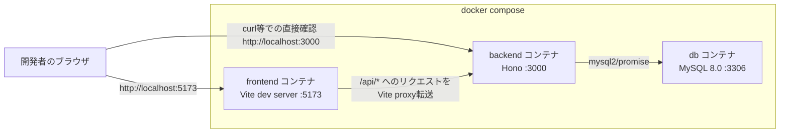
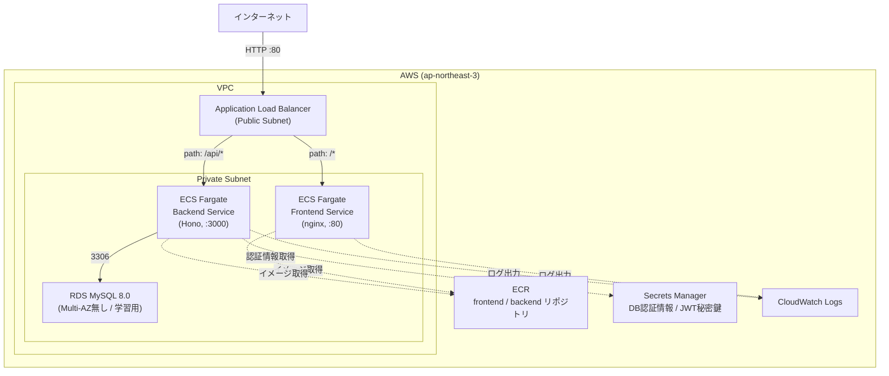
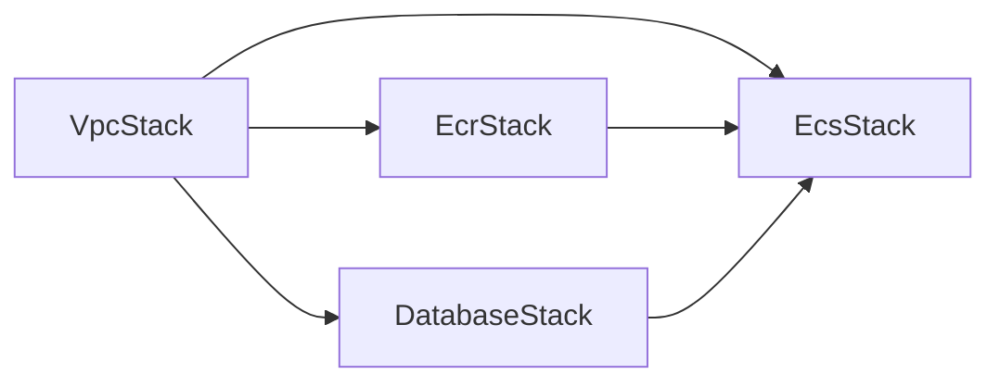

# アーキテクチャ構成図

frontend / backend / db の3コンテナ構成で、ローカルでは Docker Compose、AWS では CDK が同じ構成を再現しています。

## ローカル環境（Docker Compose）

- `frontend` は Vite の dev server をそのまま使い、`/api/*` へのリクエストをバックエンドにプロキシする（[frontend/vite.config.ts](../frontend/vite.config.ts)）。
- `backend` は `db` の起動完了（`service_healthy`）を待ってから起動する（[docker-compose.yml](../docker-compose.yml)）。
- 環境変数は `.env`（`.env.example` をコピーして作成）から読み込まれる。
- コードはホストとコンテナ間でボリュームマウントされており、保存すると即座に反映される（dev 用ターゲット）。

## AWS 環境（CDK: VPC / ECR / RDS / ECS）

### CDK スタックの依存関係

4つのスタックは以下の順序でデプロイする必要がある（[cdk/bin/app.ts](../cdk/bin/app.ts)）。

| スタック | 作成するリソース |
|---|---|
| `VpcStack` | VPC、パブリック/プライベートサブネット |
| `EcrStack` | フロントエンド/バックエンド用 ECR リポジトリ |
| `DatabaseStack` | RDS MySQL、DB 認証情報（Secrets Manager）、DB 用セキュリティグループ |
| `EcsStack` | ECS クラスター、Fargate サービス（frontend/backend）、ALB、JWT 秘密鍵（Secrets Manager）、CloudWatch ロググループ |

### ルーティングの仕組み

ALB のリスナールールがパスで振り分けるため、フロントエンドとバックエンドは**同一オリジン**としてブラウザから見える（`http://<ALBのDNS名>/` と `http://<ALBのDNS名>/api/*`）。これにより本番環境では CORS 設定を変更する必要がない（ローカルでは frontend:5173 と backend:3000 がオリジンが異なるため、`backend/src/index.ts` で CORS を許可している）。

### コスト・可用性に関する学習用の簡略化

- RDS は Multi-AZ ではなくシングル AZ（コスト優先）。
- ECS サービスは `desiredCount: 1` かつ `minHealthyPercent: 0`（デプロイ更新時に新旧タスクを並行稼働させない。一瞬の停止が発生する）。
- ALB は HTTP のみ（HTTPS 証明書・独自ドメインが無いため）。**本番運用する場合は ACM 証明書 + Route53 + HTTPS リスナーへの変更を検討すること。**
- `removalPolicy: DESTROY` を多くのリソースに設定しており、`cdk destroy` で簡単に後片付けできるようにしている（演習用のため）。
