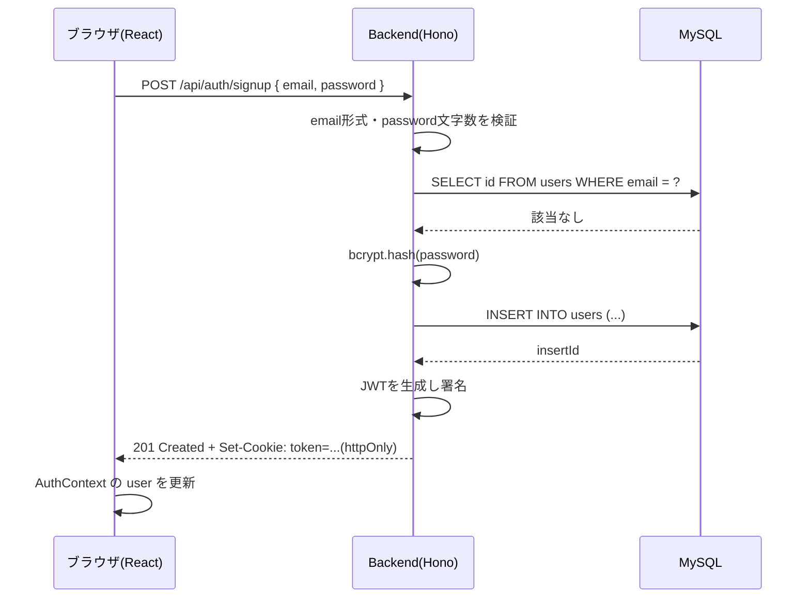
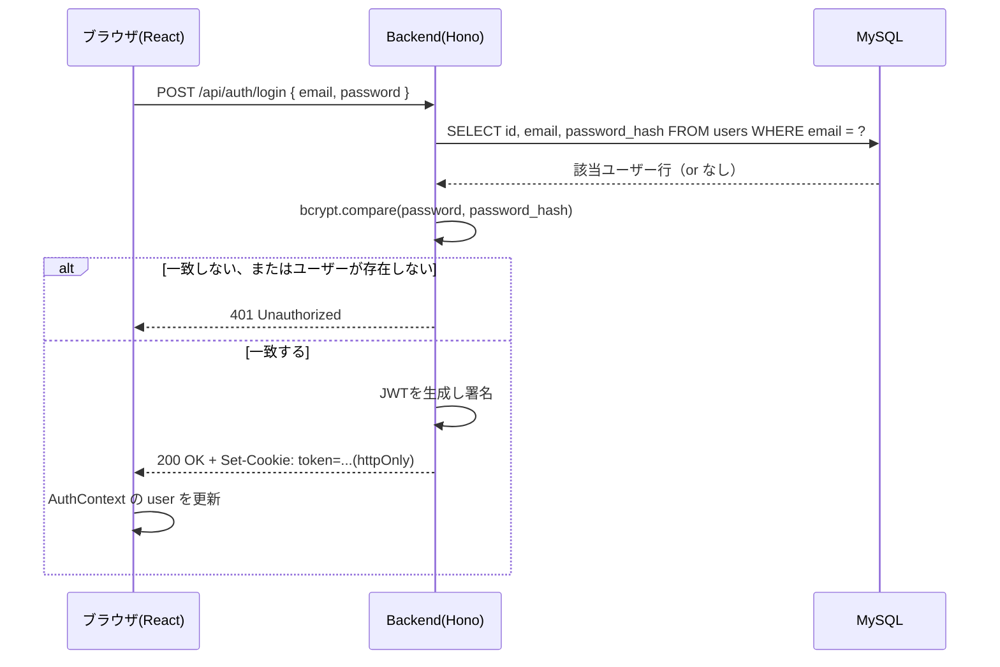
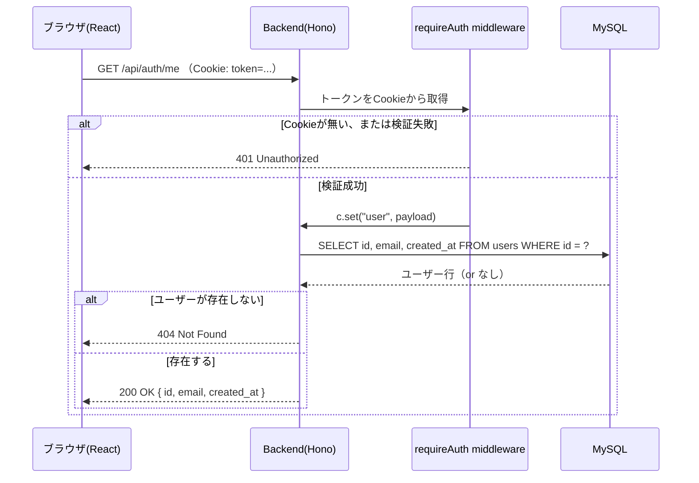
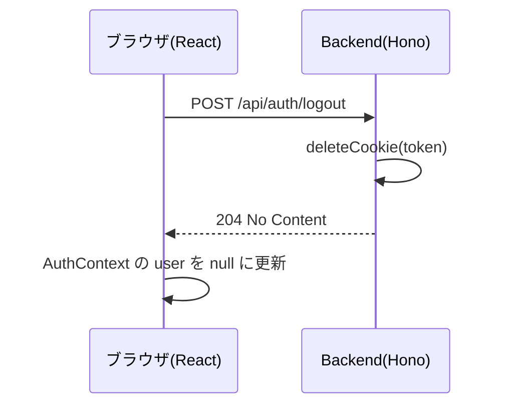

# 認証フロー

JWT を httpOnly Cookie に保存する方式で認証を行っています。トークン自体には署名のみで暗号化はしていないため、Cookie に `httpOnly` / `sameSite: Lax` を設定し、本番（HTTPS）では `secure: true` にすることを前提にしています（`backend/src/routes/auth.ts` の `setAuthCookie`）。

## 1. 新規登録（Signup）

## 2. ログイン（Login）

## 3. 認証チェック（ページ読み込み時 / 認証必須API）

フロントエンドでは `AuthProvider`（[frontend/src/context/AuthProvider.tsx](../frontend/src/context/AuthProvider.tsx)）がマウント時にこの `GET /api/auth/me` を呼び出し、ログイン状態を復元する。

## 4. ログアウト

## トークンの有効期限

- `TOKEN_TTL_SECONDS`（[backend/src/routes/auth.ts](../backend/src/routes/auth.ts)）で7日間に設定。Cookie の `maxAge` と JWT の `exp` クレームの両方に同じ値を使っている。
- 期限切れの場合、`requireAuth` の `verify()` が失敗し 401 を返すので、フロントエンドは再ログインを求める。
