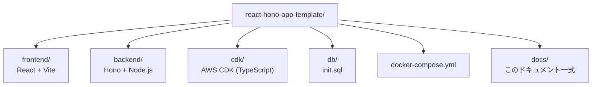

# ディレクトリ構成

リポジトリ全体は「フロントエンド」「バックエンド」「インフラ(CDK)」「DB初期化」の4つの領域に分かれています。

## frontend/

| パス | 役割 |
|---|---|
| `src/App.tsx` | ログイン後に表示されるメイン画面。ここから自分のアプリ機能を実装していく |
| `src/main.tsx` | エントリーポイント。`AuthProvider` でアプリ全体をラップする |
| `src/context/` | 認証状態の Context（`authContext.ts`）、Provider（`AuthProvider.tsx`）、フック（`useAuth.ts`）を分離して配置 |
| `src/components/` | UI コンポーネント。`auth/`（認証）、`trip/`（旅行）、`expense/`（費用・予算）、`itinerary/`（旅程）、`trip-place/`（行きたい場所）、`common/`（複数機能で共有する UI）に分類して配置 |
| `src/api/` | バックエンド API を呼び出すクライアント関数（`auth.ts`） |
| `src/types/` | フロントエンドで使う型定義 |
| `src/__tests__/` | Vitest によるコンポーネントテスト |
| `nginx.conf` | 本番ビルド（Docker イメージ）で SPA を配信する nginx 設定 |
| `Dockerfile` | dev / build / prod のマルチステージ構成 |

## backend/

| パス | 役割 |
|---|---|
| `src/index.ts` | Hono アプリのエントリーポイント。CORS 設定とルーター登録 |
| `src/routes/` | API ルーター。`auth.ts`（signup/login/logout/me）、`health.ts`（ヘルスチェック） |
| `src/middleware/auth.ts` | JWT Cookie の検証ミドルウェア（`requireAuth`）。`COOKIE_NAME` / `JWT_SECRET` の定義もここに集約 |
| `src/db/index.ts` | MySQL 接続プール（`mysql2/promise`） |
| `src/types/` | バックエンドで使う型定義 |
| `src/__tests__/` | Vitest によるルーターのテスト（DB はモック） |
| `Dockerfile` | dev / build / prod のマルチステージ構成 |

## cdk/

| パス | 役割 |
|---|---|
| `bin/app.ts` | 4つのスタックを生成し、依存関係（VPC → ECR/RDS → ECS）を組み立てるエントリーポイント |
| `lib/vpc-stack.ts` | VPC・パブリック/プライベートサブネット |
| `lib/ecr-stack.ts` | フロントエンド/バックエンド用 ECR リポジトリ |
| `lib/database-stack.ts` | RDS MySQL インスタンスと DB 認証情報（Secrets Manager） |
| `lib/ecs-stack.ts` | ECS Fargate（フロントエンド/バックエンド）+ ALB + セキュリティグループ |

詳しい構成図は [architecture.md](./architecture.md) を参照してください。

## db/

| パス | 役割 |
|---|---|
| `init.sql` | Docker Compose 起動時に実行されるテーブル DDL。新しいテーブルを追加するときはここに追記する |

## ルート直下

| パス | 役割 |
|---|---|
| `docker-compose.yml` | frontend / backend / db の3コンテナをローカルで起動する設定 |
| `.env.example` | 環境変数のテンプレート。コピーして `.env` を作成する |
| `README.md` | セットアップ手順・デプロイ手順 |
| `docs/` | このドキュメント一式 |
