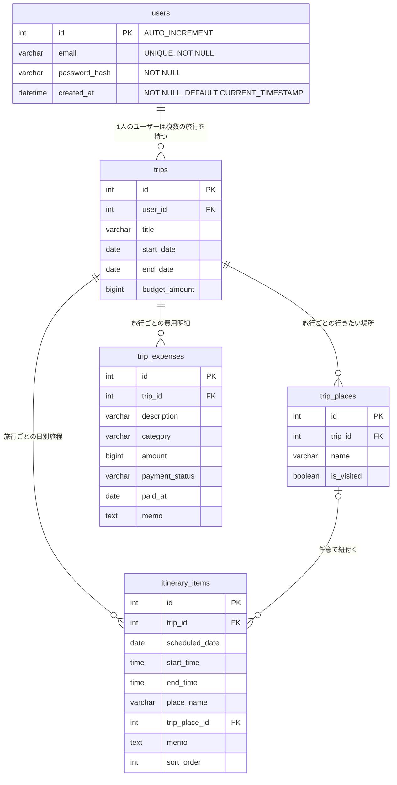

# DB 設計書

DDL の実体は [db/init.sql](../db/init.sql) です。このドキュメントはその内容を図と表で説明したものなので、テーブルを追加・変更したら両方を更新してください。

## ER 図

旅行に紐づく行きたい場所、日別旅程、費用・予算を保持します。



## テーブル定義

### users

ユーザー認証情報を保持するテーブル。

| カラム名        | 型             | 制約                                    | 説明                                                  |
| --------------- | -------------- | --------------------------------------- | ----------------------------------------------------- |
| `id`            | `INT`          | `PRIMARY KEY`, `AUTO_INCREMENT`         | ユーザー ID                                           |
| `email`         | `VARCHAR(255)` | `NOT NULL`, `UNIQUE`                    | ログインに使うメールアドレス                          |
| `password_hash` | `VARCHAR(255)` | `NOT NULL`                              | bcrypt でハッシュ化したパスワード（平文は保存しない） |
| `created_at`    | `DATETIME`     | `NOT NULL`, `DEFAULT CURRENT_TIMESTAMP` | 登録日時                                              |

- 文字コードは `utf8mb4`（絵文字・多言語対応）。
- `email` に `UNIQUE KEY uq_users_email` を付与し、重複登録を DB レベルでも防止している（API 側でも事前チェック済み: [backend/src/routes/auth.ts](../backend/src/routes/auth.ts)）。

### trips

旅行の基本情報と任意の旅行予算を保持します。

| カラム名 | 型 | 制約 | 説明 |
| --- | --- | --- | --- |
| `id` | `INT` | PRIMARY KEY, AUTO_INCREMENT | 旅行ID |
| `user_id` | `INT` | NOT NULL, FK | 所有ユーザー |
| `title` | `VARCHAR(100)` | NOT NULL | 旅行名 |
| `start_date` / `end_date` | `DATE` | NOT NULL | 旅行期間 |
| `description` | `TEXT` | NULL | 旅行の説明 |
| `budget_amount` | `BIGINT UNSIGNED` | NULL | 旅行全体の予算。未設定を許可し、日本円の整数で保持 |

### trip_expenses

旅行ごとの費用明細を保持します。支払者は保存せず、旅行の所有ユーザー自身の支出として扱います。

| カラム名 | 型 | 制約 | 説明 |
| --- | --- | --- | --- |
| `id` | `INT` | PRIMARY KEY, AUTO_INCREMENT | 費用ID |
| `trip_id` | `INT` | NOT NULL, FK | 所属する旅行 |
| `description` | `VARCHAR(100)` | NOT NULL | 費用内容 |
| `category` | `VARCHAR(30)` | NOT NULL | `transport`、`accommodation`、`food`、`activity`、`shopping`、`other` のいずれか |
| `amount` | `BIGINT UNSIGNED` | NOT NULL | 金額（日本円の整数） |
| `payment_status` | `VARCHAR(20)` | NOT NULL | `unpaid`（未払い）または `paid`（支払済み） |
| `paid_at` | `DATE` | NULL | 支払日（任意） |
| `memo` | `TEXT` | NULL | メモ（任意） |

- 旅行削除時には、費用明細も連動して削除されます。
- カテゴリ別の集計で使用するため、`trip_id, category` の複合インデックスを設定しています。

### itinerary_items

旅行ごとの日別旅程を保持します。

| カラム名                  | 型             | 制約                        | 説明                                                     |
| ------------------------- | -------------- | --------------------------- | -------------------------------------------------------- |
| `id`                      | `INT`          | PRIMARY KEY, AUTO_INCREMENT | 旅程ID                                                   |
| `trip_id`                 | `INT`          | NOT NULL, FK                | 所属する旅行                                             |
| `scheduled_date`          | `DATE`         | NOT NULL                    | 予定日                                                   |
| `start_time` / `end_time` | `TIME`         | NULL                        | 開始・終了時刻（任意）                                   |
| `place_name`              | `VARCHAR(100)` | NOT NULL                    | 場所名                                                   |
| `trip_place_id`           | `INT`          | NULL, FK                    | 行きたい場所との任意の紐付け                             |
| `memo`                    | `TEXT`         | NULL                        | メモ                                                     |
| `sort_order`              | `INT`          | NOT NULL                    | 同じ日付内の手動の表示順。時刻の早さより優先して表示する |

- 旅行削除時には、所属する旅程も削除されます。
- 行きたい場所削除時には `trip_place_id` だけが `NULL` となり、旅程の場所名・メモは保持されます。
- 同じ日付の旅程は `sort_order` 昇順で表示します。時刻の重複はAPIで検証しますが、時刻未定または終了時刻未設定の旅程は判定対象外です。

## 新しいテーブルを追加する手順

1. [db/init.sql](../db/init.sql) の末尾に `CREATE TABLE` 文を追記し、既存環境向けに `db/migrations/` へ同内容のSQLを追加する。
2. 既存データを保持する場合は、該当する `db/migrations/` のSQLを実行する。ローカルDBを再作成してよい場合は、次のコマンドで初期化できる。
   ```bash
   docker compose down -v
   docker compose up -d
   ```
3. 本ドキュメントの ER 図・テーブル定義表を更新する。
4. AWS（RDS）側に反映する場合は、README の「4-5. RDS にテーブルを作成する」の手順と同様に、自分の IP から接続して `init.sql` の追記分を実行する。

## 設計方針

- 外部キー制約（`FOREIGN KEY`）はテーブルを追加する際、整合性を保つために設定することを推奨する（`ON DELETE CASCADE` などの挙動も合わせて検討する）。
- パスワードは平文で保存しない（`bcryptjs` でハッシュ化済み）。
- 個人情報を扱うカラムを追加する場合は、用途を最小限に留める。
