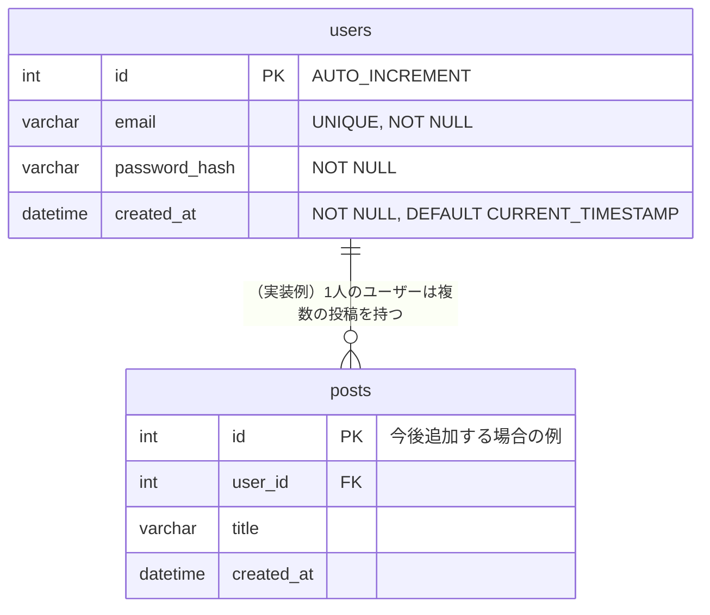

# DB 設計書

DDL の実体は [db/init.sql](../db/init.sql) です。このドキュメントはその内容を図と表で説明したものなので、テーブルを追加・変更したら両方を更新してください。

## ER 図

このテンプレートには認証用の `users` テーブルのみが存在します。自分の機能を実装する際は、`users` に対して 1対多 / 多対多 のリレーションを持つテーブルを追加していくことになります（例として `posts` テーブルとの関係を点線で示しています。`posts` テーブルはこのテンプレートリポジトリには存在しないのでレビューを出す際は ER 図から削除してください。）。



## テーブル定義

### users

ユーザー認証情報を保持するテーブル。

| カラム名 | 型 | 制約 | 説明 |
|---|---|---|---|
| `id` | `INT` | `PRIMARY KEY`, `AUTO_INCREMENT` | ユーザー ID |
| `email` | `VARCHAR(255)` | `NOT NULL`, `UNIQUE` | ログインに使うメールアドレス |
| `password_hash` | `VARCHAR(255)` | `NOT NULL` | bcrypt でハッシュ化したパスワード（平文は保存しない） |
| `created_at` | `DATETIME` | `NOT NULL`, `DEFAULT CURRENT_TIMESTAMP` | 登録日時 |

- 文字コードは `utf8mb4`（絵文字・多言語対応）。
- `email` に `UNIQUE KEY uq_users_email` を付与し、重複登録を DB レベルでも防止している（API 側でも事前チェック済み: [backend/src/routes/auth.ts](../backend/src/routes/auth.ts)）。

## 新しいテーブルを追加する手順

1. [db/init.sql](../db/init.sql) の末尾（「ここから自分のアプリに必要なテーブルを追加していく」の下）に `CREATE TABLE` 文を追記する。
2. ローカルで反映する場合は、DB コンテナを再作成する（データを消してよい場合）。
   ```bash
   docker compose down -v
   docker compose up -d
   ```
3. 本ドキュメントの ER 図・テーブル定義表を更新する。
4. AWS（RDS）側に反映する場合は、README の「4-5. RDS にテーブルを作成する」の手順と同様に、自分の IP から接続して `init.sql` の追記分を実行する。

## 設計方針

- 外部キー制約（`FOREIGN KEY`）はテーブルを追加する際、整合性を保つために設定することを推奨する（`ON DELETE CASCADE` などの挙動も合わせて検討する）。
- パスワードは平文で保存しない（`bcryptjs` でハッシュ化済み）。
- 個人情報を扱うカラムを追加する場合は、用途を最小限に留める。
