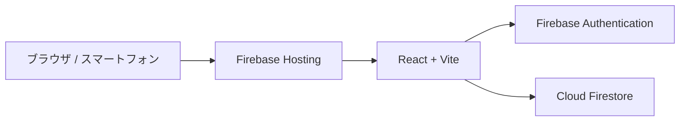

# Firebase 移行計画

このドキュメントは、既存の Hono + MySQL + JWT Cookie 構成から Firebase Authentication + Cloud Firestore + Firebase Hosting 構成へ移行するための作業記録です。

移行が完了するまで、Docker Compose によるローカル環境と AWS 向けの資産は維持します。

## 目標構成



- Firebase Hosting は SPA の静的ファイルを配信する。
- Firebase Authentication はメールアドレス・パスワード認証を担当する。
- Cloud Firestore は旅行、行きたい場所、旅程、費用を保存する。
- Cloud Functions、Cloud Run、Cloud SQL は使用しない。

## 段階的な移行

| 段階 | 内容 | 状態 |
| --- | --- | --- |
| 0 | 移行準備：現行動作の基準確認、対象資産とデータ方針の確定 | 完了 |
| 1 | Firebase プロジェクト、Auth、Firestore、Hosting、Emulator の土台を追加 | 進行中 |
| 2 | Firestore データモデル、Security Rules、Rules テストを追加 | 完了 |
| 3 | JWT Cookie 認証を Firebase Authentication に移行 | 未着手 |
| 4 | 旅行 CRUD を Firestore SDK に移行 | 未着手 |
| 5 | 場所・旅程・支出・予算を Firestore SDK に移行 | 未着手 |
| 6 | Hosting 公開、スマートフォン検証、不要資産の整理、ドキュメント更新 | 未着手 |

## 段階 0：移行準備

### 完了済みの基準確認

2026-08-26 時点で、次のコマンドは成功している。

```bash
cd backend && npm test   # 4 files / 24 tests
cd frontend && npm test  # 10 files / 45 tests
docker compose config --quiet
```

フロントエンドのテスト実行時に表示される `console.error` は、通信失敗・入力エラーを確認する既存の失敗系テストに由来する。テスト自体はすべて成功している。

### 現行資産の扱い

| 資産 | 移行中 | Firebase 版の受け入れ完了後 |
| --- | --- | --- |
| `frontend/` | Firestore / Auth 用に段階的に置換する | 維持 |
| `backend/` | ローカル動作のため維持する | Firebase 版の全機能検証後に削除候補 |
| `db/` | ローカル MySQL 用として維持する | データ移行方針の確定後に削除候補 |
| `cdk/` | AWS デプロイ資産として維持する | Firebase 運用へ完全移行後に削除候補 |
| `docker-compose.yml` | 変更しない | Firebase 版のローカル開発手順確立後に扱いを再検討 |

### 現行データと移行先の対応案

Firestore では、Firebase Authentication の UID を所有者 ID とし、旅行配下に関連データを置く。

```text
users/{uid}
  └─ trips/{tripId}
       ├─ places/{placeId}
       ├─ itineraryItems/{itemId}
       └─ expenses/{expenseId}
```

| MySQL テーブル | Firestore の配置 | 主な変更 |
| --- | --- | --- |
| `users` | `users/{uid}` | 数値 ID を Firebase Auth UID に置換。パスワードハッシュは Firebase Auth が管理 |
| `trips` | `users/{uid}/trips/{tripId}` | 数値 ID を文字列 ID に置換 |
| `trip_places` | `.../trips/{tripId}/places/{placeId}` | `trip_id` を親パスで表現 |
| `itinerary_items` | `.../trips/{tripId}/itineraryItems/{itemId}` | `trip_id` を親パスで表現。`trip_place_id` は文字列 ID または `null` |
| `trip_expenses` | `.../trips/{tripId}/expenses/{expenseId}` | `trip_id` を親パスで表現 |

### 決定事項

- ローカル MySQL の既存ユーザー・旅行データは移行しない。Firebase では新しいアカウントとデータを作成する。
- Firebase プロジェクトは開発・本番兼用の 1 プロジェクトで運用する。
- Firebase プロジェクト ID は `triply-73809`。`.firebaserc` とローカル専用の `frontend/.env` に設定する。

## 移行時の品質基準

- Firebase の実装を追加しても、既存の `docker compose up --build` によるローカル環境を壊さない。
- 各機能を移行する前後で、該当するフロントエンドテストを維持または Firebase Emulator 対応へ更新する。
- Firestore Security Rules をリポジトリで管理し、他ユーザーのデータを読み書きできないことを Emulator 上の Rules テストで確認する。
- Firebase 版を公開するまでは、AWS 関連のコード・手順を削除しない。

## 段階 1：Firebase 基盤

### 追加済みのローカル設定

- `firebase.json` に Firestore Rules / Indexes、Hosting の SPA fallback、Authentication・Firestore・Hosting Emulator のポートを定義した。
- `firestore.rules` は段階 2 の Security Rules 実装まで、すべての読み書きを拒否する安全な初期状態としている。
- `frontend/.env.example` に Firebase Web アプリの公開設定値の雛形を追加した。実際の値は `frontend/.env` にだけ設定する。
- `frontend/src/lib/firebase.ts` に Firebase App、Authentication、Firestore の遅延初期化関数を追加した。既存画面からは呼び出していないため、JWT + MySQL によるローカル環境は従来どおり動作する。
- ルートの `firebase:emulators`、`firebase:deploy` スクリプトで Firebase CLI を呼び出せるようにした。

### 検証済み

以下を確認済み。

```bash
cd frontend && npm run build
cd frontend && npm test
XDG_CONFIG_HOME=.firebase-cli-config CI=true \
  npx firebase emulators:exec --only auth,firestore,hosting \
  --project demo-trip-app "node -e \"console.log('Firebase Emulator Suite is ready')\""
```

上記の Emulator 確認は `demo-trip-app` というデモプロジェクトを指定しており、実際の Firebase プロジェクトや本番データへは接続しない。

### 次に必要な Firebase Console の設定

Firebase Console で実プロジェクトを作成した後、次の情報が必要になる。

1. Firebase プロジェクト ID
2. Web アプリの Firebase 設定値
3. Authentication のメール/パスワードプロバイダを有効化したこと
4. Cloud Firestore Standard edition を作成したこと

`.firebaserc` とローカル専用の `frontend/.env` に設定済み。Security Rules が未実装の間は Firestore を本番アプリから利用しない。

## 段階 2：データ設計と Security Rules

- [firestore-data-model.md](./firestore-data-model.md) に Firestore のパス構造、フィールド、整合性の責務分担を定義した。
- [firestore.rules](../firestore.rules) で、認証済み所有者だけが自身のユーザー配下を操作できる Rules と入力制約を実装した。
- Rules 専用の Emulator テストを `frontend/firebase-tests/` に追加した。通常の `frontend` テストとは分離しており、既存のローカル開発手順には影響しない。

```bash
npm run test:firestore-rules
```

このコマンドは `demo-trip-app` を用いて Firestore Emulator を起動し、実 Firebase プロジェクトには接続しない。所有権、未認証アクセス、想定外フィールド、旅行期間外の旅程、親旅行のないサブコレクション、費用カテゴリを確認する。

Security Rules を実 Firebase プロジェクトへ反映するのは、認証画面を Firebase Authentication に移行する段階で行う。それまでは現行アプリが Firestore を利用しないため、実プロジェクトへのデプロイは不要である。
